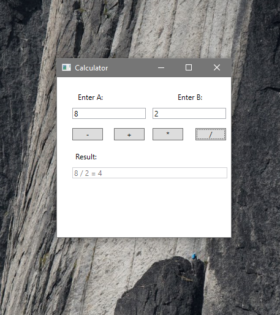

# Arithmetic-Calculator

 Arithmetic Calculator (Sum, Sub, Multi and Div) functions using WPF Frameworks on C# language

## How do you use?

1. Enter value (number) to A and B space
2. Choose options Sub, Sum, Multiplication and Division)
3. See the result

More:
You can watch videos: https://www.youtube.com/watch?v=KLMkGbTrAsk
Download installer on folder Installer
